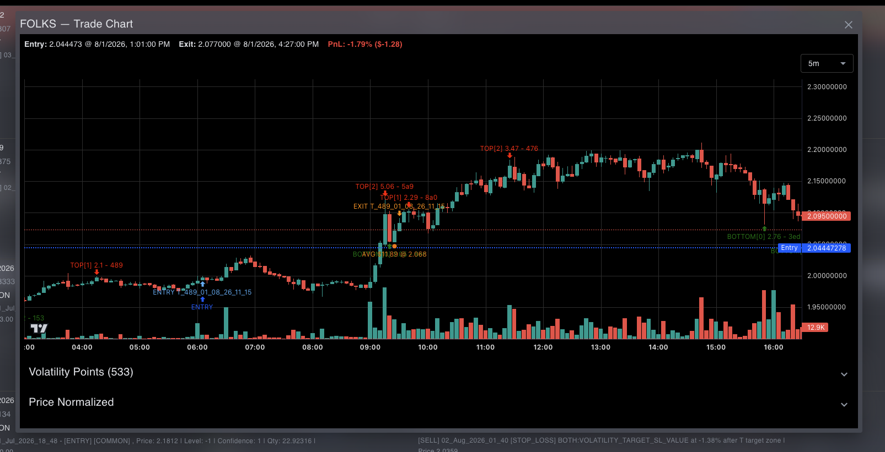
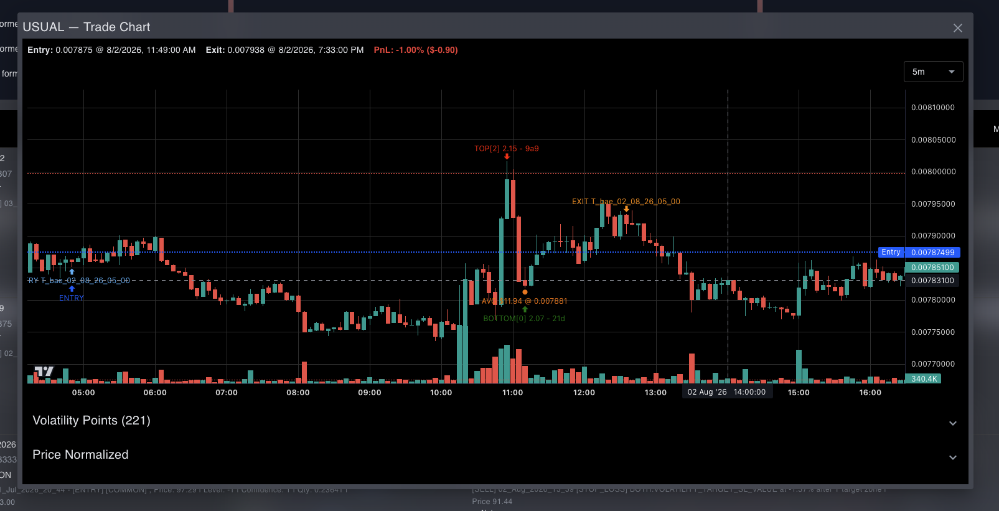
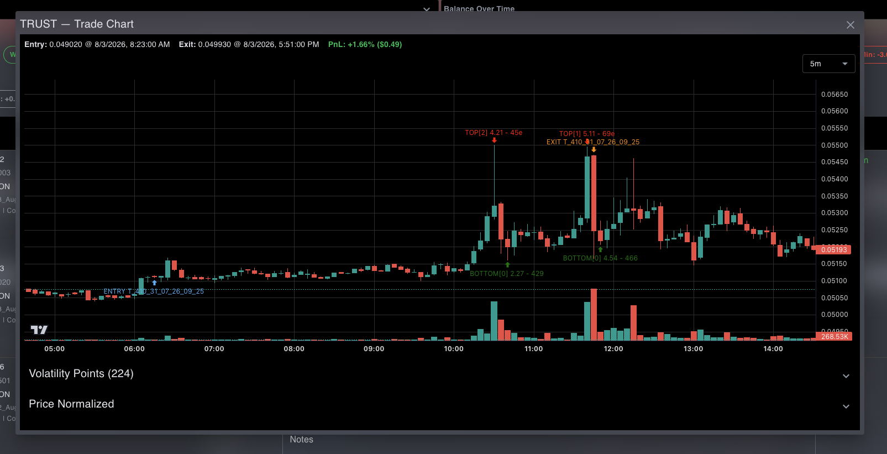

# PROBLEM

TRUST: Pump and dump candle and our system is not speed enough to catch imediately averaging

FOLKS: Pump and dump and the averaging is hapen while the vpoint is formed. we need averaging guard

USUAL: Pump and dump and the averaging is hapen while the vpoint is formed. we need averaging guard

APT: No averaging, because it guarded [SOLVED]

C: No averaging, because it guarded [SOLVED]

IOTX: No averaging, because it guarded [SOLVED]

PARTI: No averaging, because it guarded [SOLVED]

AAVE: Not averaged, because it guarded [SOLVED]

C: Averaging good, but our system runtime is not fast enough to catch the TP. [SOLVED]

W: Rare condition, Harusnya udah profit, tapi kok post averaging rescue nya gak ke trigger? karenau udah profit dikit dan vpoint target belum forming. Karena baru sekali averaging dan profitnya dibawah 1% yaitu 0.2% [RARE]

LIT: Harusnya udah profit, tapi kok post averaging rescue nya gak ke trigger? karena belom profit, dan vpoint target belum forming [SOLVED]

AAVE: Harusnya udah profit, tapi kok post averaging rescue nya gak ke trigger? karenau udah profit dikit dan vpoint target belum forming [SOLVED]

IOTX: Kok rescue post averaging gak ke trigger ya? karena vpoint belum forming. karena chart nya itu datar. Karena baru sekali averaging dan profitnya dibawah 1% yaitu 0.43% [RARE]

# SOLUTION

## POST AVERAGING RESCUE EXIT (SOLVED)

LIT: kalau udah 3 kali averaging, rugi -0.5% pun GPP exit daripada rugi banyak.

AAVE: Kalau udah 2 kali averaging + gain at least more than 0% + even vpoints is not forming

## Averaging on Pump and dump condition

FOLKS: Pump and dump and the averaging is hapen while the vpoint is formed. we need averaging guard

USUAL: Pump and dump and the averaging is hapen while the vpoint is formed. we need averaging guard

Posible solution

Should not averaging when theres big candle

## PUmp and dump

TRUST: Pump and dump candle and our system is not speed enough to catch imediately averaging

kasusnys ini
