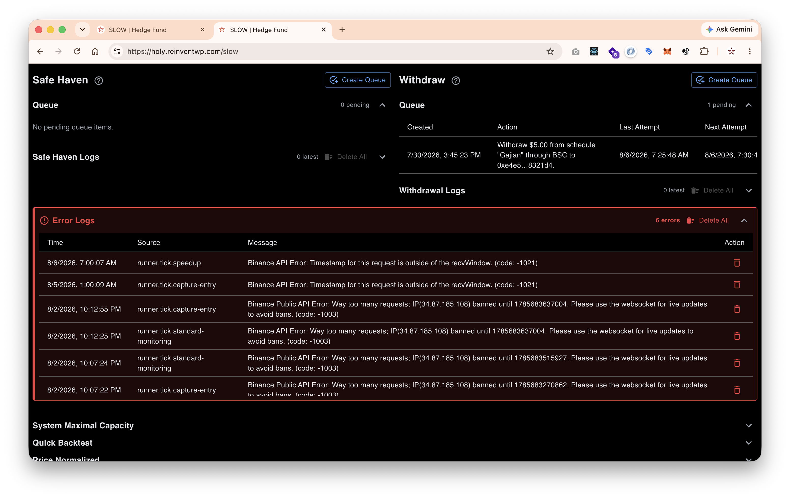

# TODO

# A. Important

On the http://localhost:3010/dev/coins

I need to have three columns, min, max, avg vPoint.pct on the table

## PUmp and dump proof

Our live runner is not pump and dump proof.

## Edge case handling

Theres condition that Capture Entry is have lot of coin at once.

since the speed up, standart monitoring and the capture entry is maybe firing at the some time

How we can overcome that? tell me your approach first

# B. Unimportant

- Do we have test that doing all the settting input that show in the setting ui

is implmented correctly?

- Bailing out reserve mechanism

currently we have available,spendable,reserve,locked,safe_haven

safe_haven: collected every month ( the amount depend on config) is un touchable balance.

now i need to make

bailout: its collected every month ( the amount depend on config) like the safe_haven do, but it can be used to only for averaging. when theres no enough spendable. on that time. this balance cant be used as entry like the `spendable` do.

TC: `BOTH:BAILOUT_BALANCE`

## ISSUES

## QA with AI

- Production live test

in the trading config i can see the boolean of "Entry Signal Bypass" is when enable that and turn off the sandbox mode

it will simulate the entry signal (by bypassing it) to the auto entry sequence can consume?

because i want to see is the live trading is i expected

Answer: With Entry Signal Bypass enabled and sandbox disabled, SLOW bypasses normal signal qualification and lets the live auto-entry flow consume a generated signal. This is a real live order path, not a simulation. Use small capital because bypass caps entry sizing to 10 USDT but still executes against the exchange.

### Automatic Manage coins

For now i do manual selection

http://localhost:3010/dev/coins

Filtering with criterion:

- Max absolute less than or equal: 5 (because we entry on level 3 and have reserve for next 2 level. so it safe until level 5)

- Avg vPoint transition less than: 48 (2 days, reason: i need to my capital is moving fast maximal is about 2 days)

- First seen at least (month ago): 12

why? because at least one year the coin doesnt pump and dump that we know it below or equal with level 5

- Market cap at least: 1M

- 24 hour volume at least: 1M
